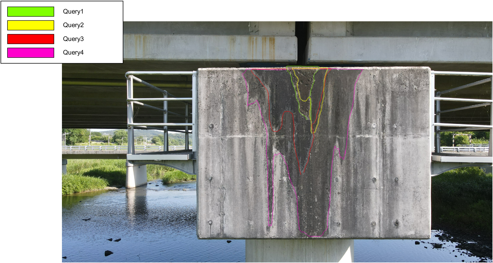

# Step 3: Visualization

# Overview

This step visualizes the spatial relationship between query images with detected damage and their paired reference images.

For each reference image selected in Step 2, all associated query images are projected onto the reference image using the estimated camera poses and depth information.
Damage regions from different inspection times are overlaid with transparency, and their boundaries are drawn as smooth contours.

This visualization allows intuitive inspection of damage location consistency, spatial overlap, and viewpoint similarity across inspections.

# 📊 Qualitative Result (Water Leakage)
<p align="center">
  
</p>

# Dependency

The authors used the following environment:

- MATLAB R2024b

# Method

```matlab
run("Scripts\Step3_Visualization\Step3.m")
```

This script performs the following operations:
- projects damage regions from query images onto the paired reference image
- overlays projected regions with transparency
- draws smooth contours to show damage boundaries
