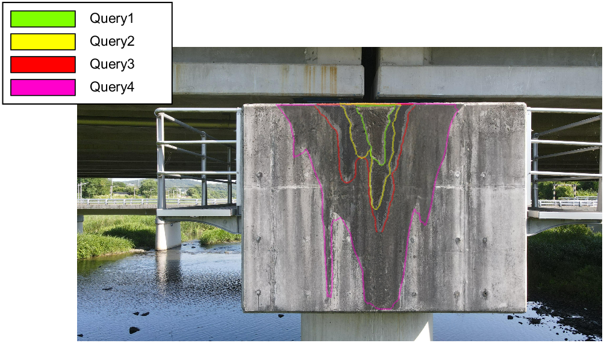
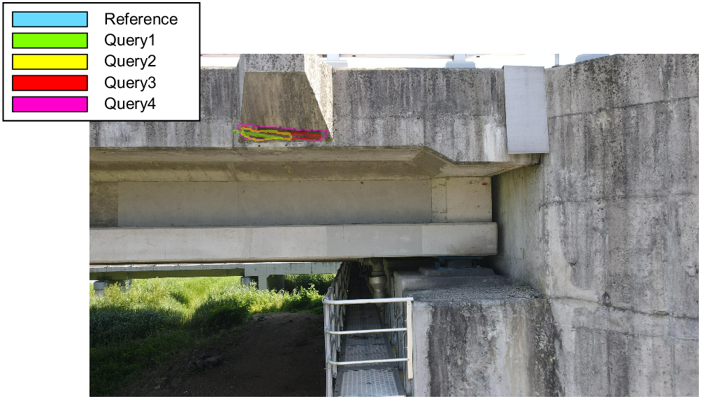
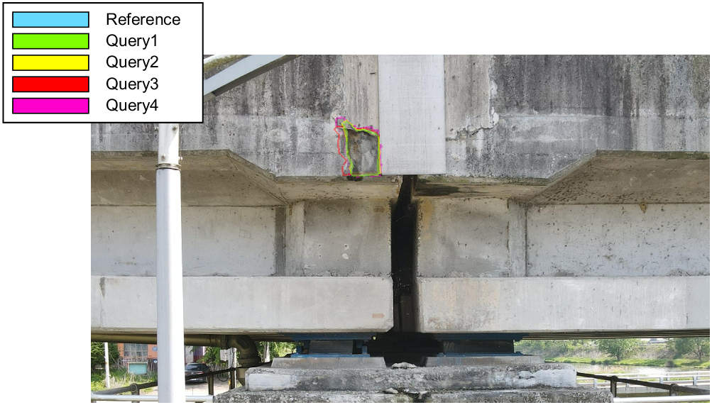

# Step 3: Visualization

# Overview

This step visualizes the spatial relationship between query images containing detected damage and the corresponding reference images.

- For each reference image selected in Step 2, the associated query images are projected onto the reference image using the estimated camera poses and depthmaps.  
- Damage regions from different inspection times are overlaid with transparency, and their boundaries are represented as smooth contours.

# 📊 Qualitative Result

* **Water leakage**
<p align="center">
  
</p>

* **Crack**
<p align="center">
  
</p>

* **Spalling**
<p align="center">
  
</p>

# Dependency

The authors used the following environment:

- MATLAB R2024b

# Method

```matlab
run("Scripts\Step3_Visualization\Step3.m")
```

This script performs the following operations:
- Projects damage masks from query images onto the paired reference image
- Overlays projected regions with transparency
- Draws smooth contours to show damage boundaries
