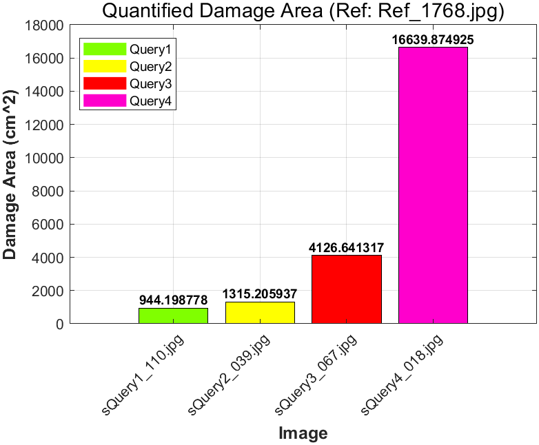
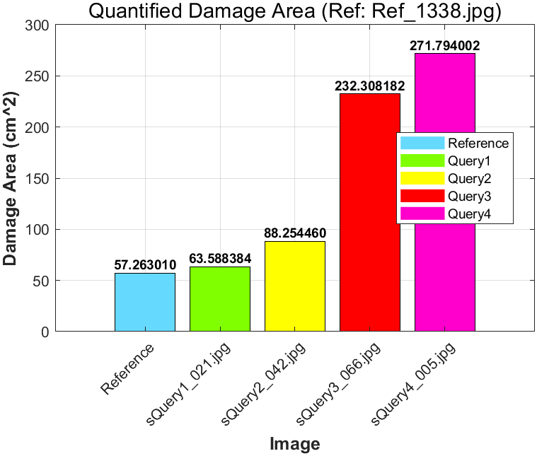
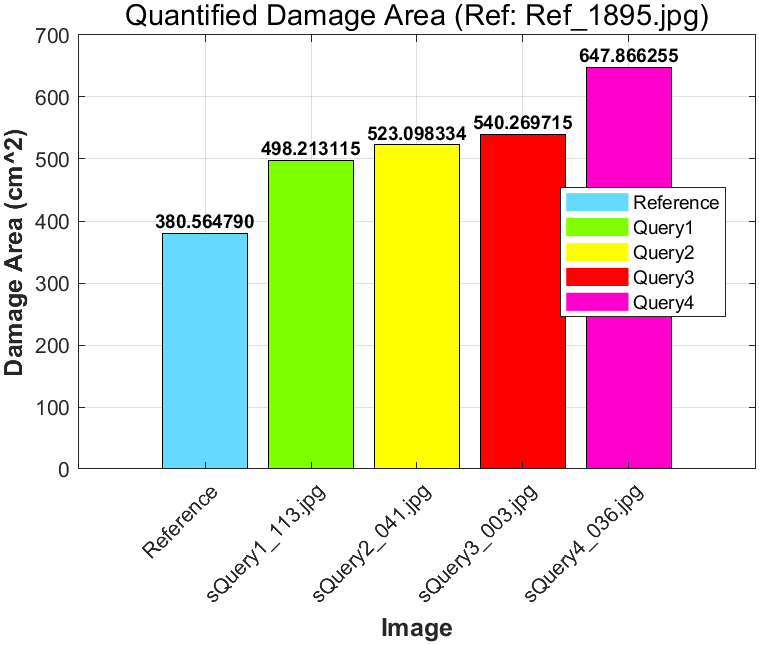

# Step 4: Quantification

# Overview

This step quantitatively estimates the damage area from each query image using depth maps and camera parameters.

- For each damage mask, pixel-wise depth values are used to estimate the local surface geometry.  
- The physical area of each damaged pixel is computed and summed to obtain the total damage area.


# 📊 Quantitative Result
The following table compares the results from this GitHub demo against the original paper's results to demonstrate the pipeline's robustness.

* **Water leakage**

<div align="center">
  
<table>
<p align="center">
  
</p>

<table>
<thead>
<tr>
<th rowspan="2">Damage type</th>
<th rowspan="2">Image set</th>
<th colspan="3">Damage area (cm²)</th>
</tr>
<tr>
<th>GitHub repository</th>
<th>Original paper</th>
<th>Reference</th>
</tr>
</thead>
<tbody>
<tr>
<td rowspan="4" align="center"><b>Water leakage</b></td>
<td align="center">Query #1</td>
<td align="center">944.20<br>(1.32%)</td>
<td align="center">943.87<br>(1.29%)</td>
<td align="center">931.89</td>
</tr>
<tr>
<td align="center">Query #2</td>
<td align="center">1315.21<br>(-4.16%)</td>
<td align="center">1338.35<br>(-2.47%)</td>
<td align="center">1372.30</td>
</tr>
<tr>
<td align="center">Query #3</td>
<td align="center">4126.64<br>(-1.23%)</td>
<td align="center">4149.65<br>(-0.67%)</td>
<td align="center">4177.84</td>
</tr>
<tr>
<td align="center">Query #4</td>
<td align="center">16639.87<br>(3.92%)</td>
<td align="center">16695.23<br>(4.26%)</td>
<td align="center">16012.65</td>
</tr>
</tbody>
</table>

</div>


* **Crack**

<div align="center">
  
<table>
<p align="center">
  
</p>

<table>
<thead>
<tr>
<th rowspan="2">Damage type</th>
<th rowspan="2">Image set</th>
<th colspan="3">Damage area (cm²)</th>
</tr>
<tr>
<th>GitHub repository</th>
<th>Original paper</th>
<th>Reference</th>
</tr>
</thead>
<tbody>
<tr>
<td rowspan="5" align="center"><b>Crack</b></td>

<td align="center">Reference</td>
<td align="center">57.26<br>(3.75%)</td>
<td align="center">57.32<br>(3.86%)</td>
<td align="center">55.19</td>
</tr>

<tr>
<td align="center">Query #1</td>
<td align="center">63.59<br>(-4.35%)</td>
<td align="center">63.70<br>(-4.18%)</td>
<td align="center">66.48</td>
</tr>

<tr>
<td align="center">Query #2</td>
<td align="center">88.25<br>(-4.32%)</td>
<td align="center">89.49<br>(-2.97%)</td>
<td align="center">92.23</td>
</tr>

<tr>
<td align="center">Query #3</td>
<td align="center">232.31<br>(-3.61%)</td>
<td align="center">230.09<br>(-4.53%)</td>
<td align="center">241.01</td>
</tr>

<tr>
<td align="center">Query #4</td>
<td align="center">272.79<br>(2.24%)</td>
<td align="center">272.43<br>(2.10%)</td>
<td align="center">266.82</td>
</tr>

</tbody>
</table>

</div>


* **Spalling**

<div align="center">
  
<table>
<p align="center">
  
</p>

<table>
<thead>
<tr>
<th rowspan="2">Damage type</th>
<th rowspan="2">Image set</th>
<th colspan="3">Damage area (cm²)</th>
</tr>
<tr>
<th>GitHub repository</th>
<th>Original paper</th>
<th>Reference</th>
</tr>
</thead>
<tbody>
<tr>
<td rowspan="5" align="center"><b>Spalling</b></td>

<td align="center">Reference</td>
<td align="center">380.56<br>(3.54%)</td>
<td align="center">384.49<br>(4.61%)</td>
<td align="center">367.55</td>
</tr>

<tr>
<td align="center">Query #1</td>
<td align="center">498.21<br>(4.42%)</td>
<td align="center">497.78<br>(4.33%)</td>
<td align="center">477.12</td>
</tr>

<tr>
<td align="center">Query #2</td>
<td align="center">523.10<br>(-4.23%)</td>
<td align="center">523.50<br>(-4.16%)</td>
<td align="center">546.23</td>
</tr>

<tr>
<td align="center">Query #3</td>
<td align="center">540.27<br>(-0.06%)</td>
<td align="center">533.34<br>(-1.34%)</td>
<td align="center">540.59</td>
</tr>

<tr>
<td align="center">Query #4</td>
<td align="center">647.87<br>(-2.17%)</td>
<td align="center">646.98<br>(-2.30%)</td>
<td align="center">662.24</td>
</tr>

</tbody>
</table>

</div>


⚠️ Technical Note on RANSAC Variability:
Note that minor discrepancies between the "GitHub repository" and "Original paper" results may occur. This is due to the stochastic nature of the RANSAC (Random Sample Consensus) algorithm used during the Plane Fitting process for damage quantification. While the overall precision remains high, these randomized iterations can lead to slight variations in each run.


# Dependency

The authors used the following environment:

- MATLAB R2024b

# Method

```matlab
run("Scripts\Step4_Quantification\Step4.m")
```

This script performs the following operations:
- Reads damage masks for each query image
- Estimates a plane of each damage mask using depth values and RANSAC
- Converts the detected pixels to physical area using camera intrinsics, extrinsics, and SCF
- Computes the total damage area of each damage
