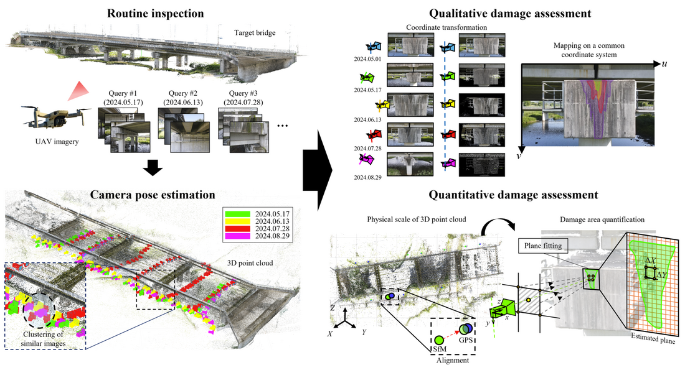

# Long-term Monitoring of Damage Progression

This repository provides a research-oriented implementation for long-term monitoring of surface damage progression on bridges using temporal UAV images.  
The proposed workflow integrates **YOLOv8-based damage segmentation**, **structure-from-motion (SfM)**, and **hierarchical localization (hloc)** to enable consistent damage identification, spatial alignment, and quantitative comparison across different inspection times.

This repository is intended to support **reproducibility, transparency, and methodological understanding**, rather than large-scale benchmarking.

---

## Overview

<p align="center">
  
</p>

The proposed framework aims to visualize and quantify the progression of surface damage through coordinate transformation of UAV imagery acquired from different inspection times.

The core components of the pipeline are:

1. **Qualitative damage assessment** based on instance segmentation  
2. **Quantitative damage assessment** via damage area analysis


This repository focuses on providing:
- Source code    
- Representative sample images  
- A lightweight demo pipeline  

---

## Repository Structure

```
Long-term-monitoring-of-damage-progression/
│
├─ Demo/
│  ├─ Scripts/
│  │  ├─ Helper/                    # Shared MATLAB utility functions
│  │  │
│  │  ├─ Step1_CameraPoseEstimation/
│  │  │  ├─ Data/                   
│  │  │  ├─ extend.py
│  │  │  └─ README.md
│  │  │
│  │  ├─ Step2_SimilarityIndex/
│  │  │  ├─ Helper/
│  │  │  ├─ Segmentation_mask/      
│  │  │  ├─ Step2.m
│  │  │  ├─ workspace_step2.mat
│  │  │  └─ README.md
│  │  │
│  │  ├─ Step3_Visualization/
│  │  │  ├─ Helper/
│  │  │  ├─ Step3.m
│  │  │  └─ README.md
│  │  │
│  │  └─ Step4_Quantification/
│  │     ├─ Helper/
│  │     ├─ Step4.m
│  │     └─ README.md
│  │
│  └─ README.md                     # Demo-level instructions
│
├─ Instance_segmentation/
│  ├─ train_seg.py                  # YOLOv8 training script
│  └─ data/
│     └─ data.yaml
│
├─ README.md                        # Project overview
├─ .gitattributes
└─ .gitignore
```

- Demo/: Step-by-step demo pipeline for visualization and quantitative analysis of surface damage progression.
- Demo/Scripts/: MATLAB scripts implementing the core workflow from camera pose estimation to damage quantification.
- Demo/Scripts/Helper/: Shared MATLAB utility functions for coordinate transformation, depth handling, plane estimation, and visualization.
- Step1_CameraPoseEstimation/: Preparation of camera poses and geometric information based on SfM results.
- Step2_SimilarityIndex/: Similarity index computation and selection of corresponding reference–query image pairs.
- Step3_Visualization/: Projection and visualization of segmented damage regions across different inspection times.
- Step4_Quantification/: Quantitative measurement of damage attributes based on the projected results.
- Instance_segmentation/: Training scripts and configuration files for the YOLOv8-based damage instance segmentation model.

---

## Methods Overview

### Damage Segmentation (YOLOv8)

Surface damage is identified using a **YOLOv8-based instance segmentation model** trained to detect damage types commonly observed on concrete bridge surfaces.

- Model: YOLOv8-seg  
- Damage types: crack, spalling, water leakage (custom)
- Output: pixel-level segmentation masks  

YOLOv8 (Ultralytics):  
https://github.com/ultralytics/ultralytics

---

### Structure-from-Motion (COLMAP)

**COLMAP** is used to reconstruct the 3D point cloud of the bridge and to maintain a common coordinate system between UAV images captured at different inspection times in this study.

The reconstructed SfM model provides:
- Camera poses  
- 3D point clouds  
- A shared common coordinate system  

COLMAP:  
https://github.com/colmap/colmap

---

### Hierarchical Localization (hloc)

To achieve robust camera pose estimation across routine inspections with significant appearance changes, **hierarchical localization (hloc)** is employed.

The localization pipeline integrates:
- Global image retrieval  
- Local feature matching  
- Geometric verification  

This approach improves robustness under varying illumination, viewpoint, and surface conditions.

hloc:  
https://github.com/cvg/Hierarchical-Localization

---

## Demo (Reproducible Example)

A lightweight demo is provided to allow users to directly reproduce the core visualization and quantification process.

The demo assumes that:
- SfM reconstruction has already been performed 
- Segmentation masks are provided  
- Similarity index has already been calculated
- Scale conversion factor has already been calculated 


## Dataset Availability

The UAV imagery used in this study were captured from an operational prestressed concrete girder bridge at different inspection times.

Representative sample images required to run the demo pipeline are included in this repository.

The full set of **initial inspection images** and **routine inspection images** used in this study are available via an external cloud storage link due to their large size:

- Dropbox (Initial and Routine Inspection Images):  
  https://www.dropbox.com/scl/fo/g4ahvivb0yth20ewehwgr/AJEZW_NpcgJocoW_Zm26j30?rlkey=rw2mhq2nev4nq5zln90ptqxge&st=q6v1whd5&dl=0 

These images are provided to support transparency and reproducibility of the proposed pipeline.  
Researchers interested in accessing the complete dataset for academic purposes may also contact the authors.

- Email: mn2383@seoultech.ac.kr


## Acknowledgements

This work makes use of the following open-source projects:

  YOLOv8 (Ultralytics): https://github.com/ultralytics/ultralytics
  
  COLMAP: https://github.com/colmap/colmap
  
  Hierarchical Localization (hloc): https://github.com/cvg/Hierarchical-Localization
